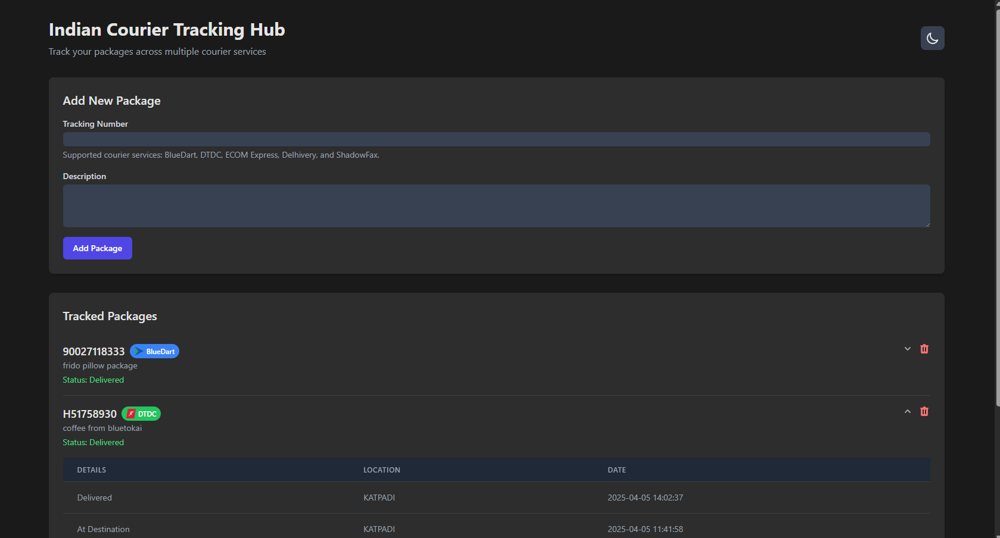

# Indian Courier Tracking Hub

A comprehensive tracking system that integrates with multiple Indian courier services, providing unified tracking capabilities, automated status updates, and real-time notifications. The system periodically checks package statuses and sends updates via Telegram when changes are detected.

## Features

### Carrier Support

Currently integrated with major Indian logistics providers:

- Bluedart
- DTDC (with both API and Selenium-based tracking)
- Delhivery
- ShadowFax
- Ecom Express

### Core Functionality

- **Automated Tracking**: Periodic status checks for all active packages
- **Real-time Notifications**: Instant Telegram updates on status changes
- **Status History**: Complete tracking history for each package
- **Delivery Detection**: Automatic package status management upon delivery
- **RESTful API**: Comprehensive endpoints for tracking management
- **Concurrent Tracking**: Efficient parallel processing of tracking requests



## Technical Stack

- **Backend Framework**: FastAPI
- **Database**: SQLModel with SQLite
- **Task Scheduling**: AsyncIO Scheduler (APScheduler)
- **Web Scraping**:
  - Selenium with Chrome for DTDC tracking
  - BeautifulSoup4 for HTML parsing
  - Requests for HTTP calls
- **Containerization**: Docker with multi-stage builds
- **Notifications**: Telegram Bot API
- **Logging**: Loguru for advanced logging capabilities

## Environment Variables

The application uses the following environment variables, which should be defined in a `.env` file:

- `TELEGRAM_TOKEN`: The token for the Telegram bot
- `CHANNEL_ID`: The ID of the Telegram channel to send notifications to
- `SLEEP_INTERVAL`: The interval (in seconds) between status checks (default: 10 seconds)

## Installation

### Local Installation

1. Clone the repository
2. Create a virtual environment and activate it:
   ```bash
   python -m venv venv
   source venv/bin/activate  # On Windows: venv\Scripts\activate
   ```
3. Install the required dependencies:
   ```bash
   pip install -r requirements.txt
   ```
4. Install Chrome and ChromeDriver:

   ```bash
   # For Raspberry Pi (Debian/Ubuntu)
   sudo apt-get update
   sudo apt-get install -y chromium-browser chromium-chromedriver

   # For other Linux distributions, use your package manager
   # For Windows/Mac, download Chrome and ChromeDriver manually
   ```

5. Copy `.env.example` to `.env` and configure your environment variables
6. Run the application using FastAPI:
   ```bash
   uvicorn main:app --reload
   ```

### Docker Installation

The application is configured to run in Docker with Selenium support. The Dockerfile includes:

- Installation of Google Chrome and ChromeDriver
- Configuration for headless browser operation
- Shared memory allocation for stable operation

To run the application using Docker:

```bash
# For development
docker-compose -f docker-compose.dev.yml up

# For production
docker-compose -f docker-compose.prod.yml up
```

To test the Selenium setup in the Docker container:

```bash
# Build the container
docker-compose -f docker-compose.dev.yml build

# Run the test script
docker-compose -f docker-compose.dev.yml run api python test_selenium.py
```

## Usage

### Start the Application

#### Using Docker

```bash
docker-compose -f docker-compose.dev.yml up  # For development
docker-compose -f docker-compose.prod.yml up  # For production
```

#### Using FastAPI directly

```bash
uvicorn main:app --reload
```

### API Endpoints

- `GET /health`: Check the health of the application
- `GET /track`: List all tracked packages with pagination
  - Query Parameters:
    - `offset`: Number of records to skip (default: 0)
    - `limit`: Maximum number of records to return (default: 10)
- `POST /track`: Create a new package tracking entry
  - Request Body:
    ```json
    {
      "number": "tracking_number",
      "description": "package_description"
    }
    ```
- `DELETE /track/{num}`: Delete a package tracking entry by its number

## Scheduler

The application uses APScheduler to periodically check and update package statuses. The scheduler is configured to run every minute and can be adjusted through the `SLEEP_INTERVAL` environment variable.

## Troubleshooting

### Selenium Issues in Docker

If you encounter Selenium-related errors in Docker:

1. Ensure the container has sufficient shared memory:

   ```bash
   docker-compose -f docker-compose.dev.yml down
   docker-compose -f docker-compose.dev.yml up --build
   ```

2. Check Chrome and ChromeDriver versions match:

   ```bash
   docker-compose -f docker-compose.dev.yml run api google-chrome --version
   docker-compose -f docker-compose.dev.yml run api chromedriver --version
   ```

3. Run the test script to verify Selenium setup:
   ```bash
   docker-compose -f docker-compose.dev.yml run api python test_selenium.py
   ```

## Contributing

Contributions are welcome! Please fork the repository and submit a pull request with your changes.

## License

This project is licensed under the MIT License.
